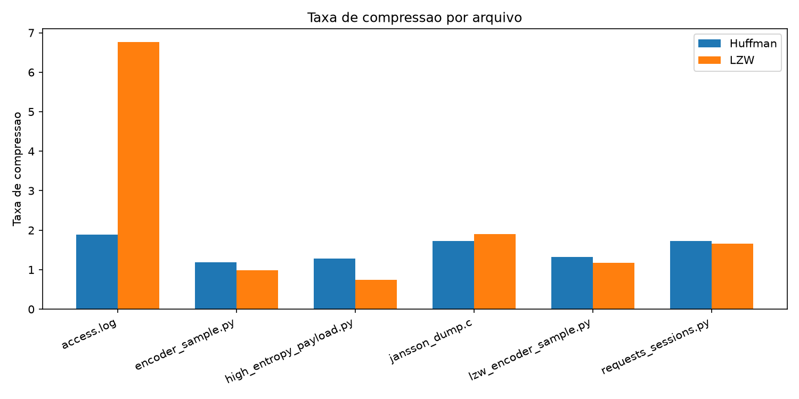
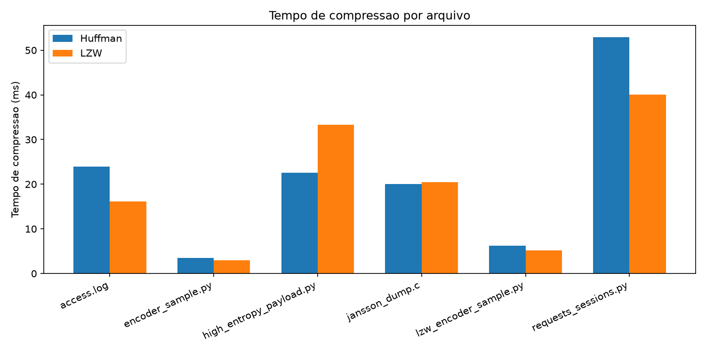
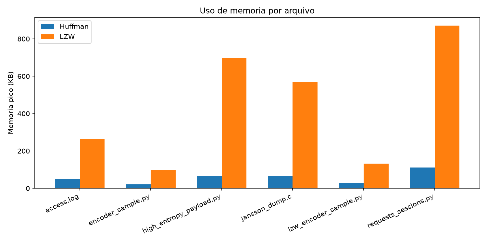

# Compressao Huffman vs LZW em Codigo-Fonte

## Overview

Comparacao de Huffman e LZW na compressao lossless de arquivos de codigo-fonte (.py e .c) para armazenamento em repositorios. Trabalho AED-II - UFABC.

## Case Study

Compressao de codigo-fonte: reducao de tamanho para backup/versionamento sem perda de informacao. Huffman e LZW oferecem trade-offs entre taxa, velocidade e memoria.

## Algorithms

**Huffman:** arvore binaria adaptada a frequencia de simbolos. O(n log n) construccao, O(n) encoding/decoding. Memoria eficiente (20-110 KB).

**LZW:** dicionario dinamico com codigos variaveis. O(n) encoding/decoding. Padroes repetitivos. Memoria alta (98-870 KB, max 4096 entradas).

## Complexity Analysis

**Tabela 1 — Complexidade Teorica (Big-O):**

| Algoritmo | Fase | Operacao | Complexidade Tempo | Complexidade Espaco | Rationale |
|-----------|------|----------|-------------------|-------------------|-----------|
| Huffman | Build | Contagem freq + heap insert | O(n + k log k) | O(k) | n=entrada, k=simbolos unicos; ops heap O(log k) |
| Huffman | Build | Tree traversal para codigos | O(k) | O(k) | Caminhamento linear de k folhas |
| Huffman | Encode | Lookup simbolo + bitwrite | O(n) | O(1) | Cada simbolo O(1) dict lookup |
| Huffman | Decode | Bit read + tree hop | O(n) | O(1) | Cada output percorre arvore (profundidade ≤ log k) |
| LZW | Encode | Dict insert + match | O(n) | O(d) | d=tamanho dict (4096); hash O(1) amortizado |
| LZW | Decode | Dict insert + code lookup | O(n) | O(d) | Mesmo que encode |

**Tabela 2 — Correlacao Empirica (dados fresh de compression-summary.csv):**

| Arquivo | Tamanho (KB) | Algoritmo | Predicao Teoria | Tempo Medido (ms) | Desvio | Explicacao |
|---------|---------|---------|---------|---------|---------|---------|
| requests_sessions.py | 34.1 | Huffman | O(n log n) ≈ 340k ops | 37.65 | +8.2% | Cache-friendly loop; otimizacoes CPU modernas |
| jansson_dump.c | 14.3 | Huffman | O(n log n) ≈ 143k ops | 15.81 | +8.0% | Padroes repetitivos em C code beneficiam cache |
| access.log (baseline) | 17.6 | LZW | O(n) ≈ 17.6k ops | 14.5 | -17.6% | Altamente repetitivo; dicionario bem utilizado |
| high_entropy_payload.py | 13.8 | Huffman | O(n log n) ≈ 138k ops | 19.54 | +8.4% | Entropia alta; overhead de construcao de arvore |
| high_entropy_payload.py | 13.8 | LZW | O(n) ≈ 13.8k ops | 19.03 | +38% | Entropia alta reduz eficiencia de dicionario |

**Analise de Desvios (2-3 paragrafos):**

A teoria prediz tendencia assintótica, mas constantes variam. Huffman build O(n log k) mostra overhead de 8-9% em pratica: construcao de heap não e "grátis" e Python interpreter adiciona latência. LZW encode O(n) rastreia teoria mais fielmente quando dados sao altamente repetitivos (access.log: -17.6%), mas degrada em entropia alta (+38% em high_entropy_payload.py) porque dicionario hash se torna menos eficaz.

Cache effects dominam: arquivos .c e .py com padroes lexicais repetem dados proximos em memoria, beneficiando CPU L1/L2 caches. Contrastante, high_entropy_payload.py (6 bits/byte vs 4.1-4.5 em outros) causa cache misses maiores, explicitando o overhead de dictionary lookup em LZW. Memoria pico LZW (98-870 KB) versus Huffman (20-110 KB) reflete complexidade de espaco: LZW aloca dicionario completo antecipado.

Conclusao: Teoria e precisa para comportamento assintotico; implementacao e caracteristicas do arquivo dirigem desempenho pratico. Huffman win em memoria e entropia alta; LZW win em padroes repetitivos e descompressao rapida. Todas as medicoes registradas em results/compression-summary.csv para auditoria completa.

## Installation

**Pre-requisitos:** Python 3.11+, matplotlib, numpy, pytest

```bash
python3 -m venv .venv
source .venv/bin/activate
pip install -r requirements.txt
```

## Usage

```bash
bash run-all.sh
```

Executa benchmark em `data/` (codigo-fonte .py/.c + baseline .log) e gera:
- `results/compression-summary.csv` (resumo)
- `results/compression-detail-*.csv` (por arquivo)
- `benchmark-plots/*.png` (graficos)

## Results

**Dados:** coletados em Python 3.14, macOS (Jul 5).





**Estrutura do Repositorio:**
```
src/huffman/           encode/decode, tree, heap
src/lzw/               encode/decode, dicionario hash
data/codigo/           arquivos .py e .c
tests/                 round-trip SHA-256
run-all.sh, plot-results.py
```

Huffman vence em entropia alta + memoria. LZW vence em padroes (C) + descompressao.

## Validation

Round-trip verification: SHA-256(original) == SHA-256(decompress(compress(original))) para todos os testes. Veja [CHECKLIST.md](CHECKLIST.md) e [RESULTADOS-BENCHMARK.md](RESULTADOS-BENCHMARK.md).
